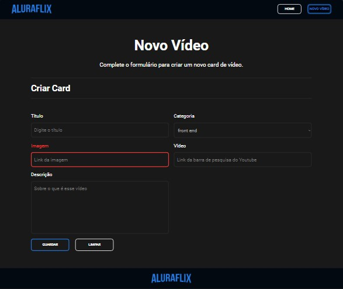

# AluraFlix

AluraFlix é um projeto de gestão de vídeos de aulas, projeto didático do programa ONE(Oracle Next Education). Com ele, você pode cadastrar, editar e excluir vídeos de uma lista, além de visualizar informações destacadas em um banner dinâmico. O projeto utiliza o **json-server** para simular uma API.

## Funcionalidades

### Página Home
- **Lista de Vídeos**:
  - Cada card na sua respectiva lista.
  - Exibição dos vídeos em formato de cards, com thumbnail para identificá-los.
  - Opções para **editar** e **excluir** vídeos diretamente nos cards.


- **Banner dinâmico**:
  - Aleatoriamente um dos vídeos cadastrados é destacado no topo da página.
  - Informações do vídeo destacado, como título e descrição, são exibidas no banner.


### Página Novo Vídeo
- Formulário para cadastro de novos vídeos.
  - Campos obrigatórios como título, link para imagem e vídeo.
  - Ao enviar o formulário, o novo vídeo é adicionado à lista e pode ser visualizado na página Home.



## Tecnologias Utilizadas

- **React**: Construção da interface do usuário.
- **JavaScript**: Manipulação de dados e interatividade.
- **json-server**: Simulação de uma API REST para o gerenciamento dos vídeos.

## Instalação e Execução do Projeto

1. Clone este repositório:
   ```bash
   git clone https://github.com/seu-usuario/aluraflix.git
   ```
2. Acesse a pasta do projeto:
   ```bash
   cd aluraflix
   ```
3. Instale as dependências (caso não esteja instalado):
   ```bash
   npm install
   ```
4. Inicie o json-server para simular a API:
   ```bash
   npm run server
   ```
5. Inicie o projeto react.
   ```bash
   npm run dev
   ```
6. Abra o `localhost` indicado em um navegador para visualizar o projeto.

## Contribuição

Contribuições são bem-vindas! Sinta-se à vontade para abrir uma issue ou enviar um pull request com melhorias e novas funcionalidades.